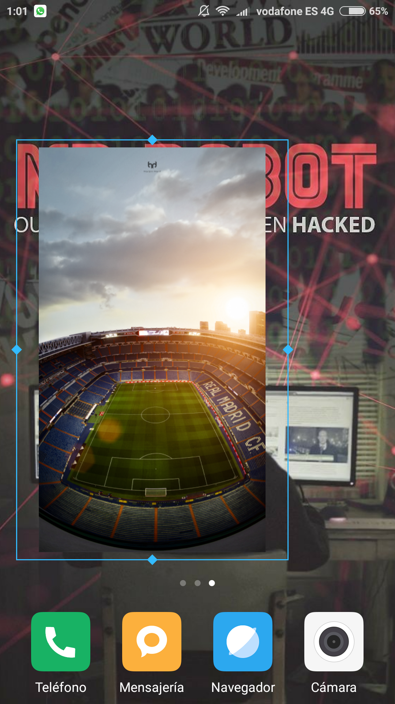

# Image Desktop Widget

### Widget for Android devices.

v2 -> Base de datos sqlite para guardar las Uri de las imágenes de cada widget, para evitar que tras un reinicio del dispositivo se desconfiguren los widgets.

[Enlace de Descarga](https://mega.nz/#!GYNlRLBY!8Lm-LQ08VFFypaE0AT4pT581CW3SbKR_2gddwuGkAzU)
